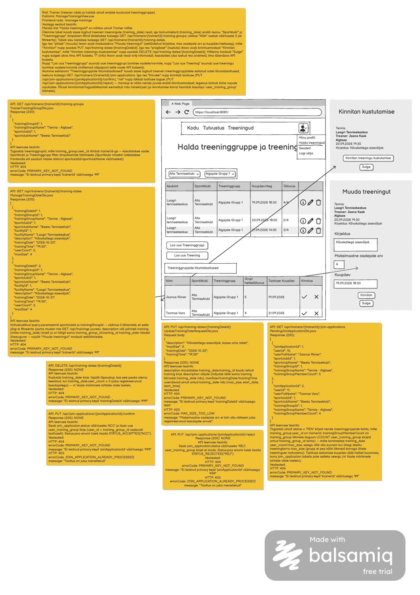

# Treeneri treeningute nimekirja päring (haldusvaade)

**Teenus:** `GET /api/trainers/{trainerId}/training-dates`

**Vaste balsamic mockupis:** "Halda treeninggruppe ja treeninguid" vaade (`ManageTrainingsView.vue`, route `/manage-trainings`), ülemine tabel (Asukoht / Spordiklubi / Treeninggrupp / Kuupäev/Aeg / Täituvus), lehekülg 1/1 (vt lisatud pilt `Treeneri-treeningute-nimekirja-paring.png`). Vt ka vaate märkmeid failis `docs/balsamic/notes/ManageTrainingsView-markmed.md`.



## Sisend

Path variable:

| Parameeter | Kirjeldus |
|---|---|
| `trainerId` | Treener, kelle enda treeningute (`training_date`) nimekirja päritakse (`user.id`) |

Query parameetrid:

| Parameeter | Kohustuslik | Kirjeldus |
|---|---|---|
| `sportclubId` | Jah | Filtreerib `training_group.sportclub_id` järgi. Väärtus `0` tähendab, et selle järgi ei filtreerita. |
| `trainingGroupId` | Jah | Filtreerib `training_group.id` järgi. Väärtus `0` tähendab, et selle järgi ei filtreerita. |

Mõlemad query parameetrid on kohustuslikud (sama muster, mis `GET /api/trainings` juures — vt `Treeningute-nimekirja-paring.md`), kuid `0` tähendab "ei filtreerita".

## Väljund

**Response (200 OK):** treeneri enda treeningute (üks rida iga `training_date` kirje kohta) nimekiri (`ManageTrainingDateDto.java` massiiv). Kui filtritele ei vasta ükski rida, tagastatakse tühi massiiv `[]`.

```json
[
  {
    "trainingDateId": 1,
    "trainingGroupId": 1,
    "trainingGroupName": "Tennis - Algtase",
    "sportclubId": 1,
    "sportclubName": "Beeta Tenniseklubi",
    "facilityId": 1,
    "facilityName": "Laagri Tennisekeskus",
    "description": "Kõvakattega siseväljak",
    "trainingDate": "2026-10-20",
    "trainingTime": "19:30",
    "userCount": 2,
    "maxSize": 4
  },
  {
    "trainingDateId": 2,
    "trainingGroupId": 1,
    "trainingGroupName": "Tennis - Algtase",
    "sportclubId": 1,
    "sportclubName": "Beeta Tenniseklubi",
    "facilityId": 1,
    "facilityName": "Laagri Tennisekeskus",
    "description": "Kõvakattega siseväljak",
    "trainingDate": "2026-10-21",
    "trainingTime": "19:30",
    "userCount": 3,
    "maxSize": 4
  },
  {
    "trainingDateId": 3,
    "trainingGroupId": 1,
    "trainingGroupName": "Tennis - Algtase",
    "sportclubId": 1,
    "sportclubName": "Beeta Tenniseklubi",
    "facilityId": 1,
    "facilityName": "Laagri Tennisekeskus",
    "description": "Kõvakattega siseväljak",
    "trainingDate": "2026-10-22",
    "trainingTime": "19:30",
    "userCount": 3,
    "maxSize": 4
  }
]
```

Väljade tähendus:

- `trainingDateId` — `training_date.id`
- `trainingGroupId` / `trainingGroupName` — `training.training_group_id` kaudu leitud `training_group.id` / `name`
- `sportclubId` / `sportclubName` — `training_group.sportclub_id` kaudu leitud `sportclub.id` / `name`
- `facilityId` / `facilityName` — `training_date.facility_id` / `facility.name`
- `description` — `training_date.training_id` kaudu leitud `training.description` (**mitte** `training_date` enda väli — `training_date` tabelis kirjeldust pole). Kõikidel sama `training_id` all olevatel `training_date` ridadel on see seega ühesugune.
- `trainingDate` / `trainingTime` — `training_date.start_date` / `start_time`
- `userCount` / `maxSize` — `training_date.user_count` / `max_size`

Näidisandmed (`3_import.sql`): treener Jaana Kask (`user.id = 5`), treeninggrupp "Tennis - Algtase" (`training_group.id = 1`, `sportclub.id = 1` "Beeta Tenniseklubi"), `training.id = 1` ("Tennis - Algtase (Laagri)", `description = 'Kõvakattega siseväljak'`) — sellel treeningul on kolm toimumiskorda: `training_date.id` 1, 2, 3 (kuupäevad 2026-10-20/21/22, kell 19:30, täituvused 2/4, 3/4, 3/4).

## Eesmärk

`ManageTrainingsView.vue` kutsub selle teenuse vaate avamisel ja iga kord, kui treener muudab lehe ülaosa "Sportklubi" või "Treeninggrupp" filtrit. Iga tabeli rida vastab ühele `training_date` kirjele — sama treeninggrupi mitu toimumiskorda kuvatakse mitme eraldi reana. `description` väli laetakse valmis kaasa, et "pliiats" (muuda) ikooni klõpsates avanev "Muuda treeningut" modaalaken saaks kirjelduse kohe eeltäidetuna näidata, ilma täiendava API kutseta.

Teenus tagastab ainult treeninguid, mille treeninggrupi omanik (`training_group.user_id`) on antud `trainerId` — teise treeneri treeninguid siia kunagi ei satu.

## Seotud andmebaasi tabelid

Vt `docs/database/2_create.sql`.

### `training_date`

```sql
CREATE TABLE training_date (
    id serial  NOT NULL,
    training_id int  NOT NULL,
    facility_id int  NOT NULL,
    start_date date  NOT NULL,
    start_time time  NOT NULL,
    duration int  NOT NULL,
    status varchar(3)  NOT NULL,
    user_count int  NOT NULL,
    max_size int  NOT NULL,
    date_added date  NOT NULL,
    CONSTRAINT training_date_pk PRIMARY KEY (id)
);
```

### `training`

```sql
CREATE TABLE training (
    id serial  NOT NULL,
    training_group_id int  NOT NULL,
    default_facility_id int  NOT NULL,
    name varchar(255)  NOT NULL,
    maxsize int  NOT NULL,
    description varchar(255)  NULL,
    default_start_date date  NULL,
    default_end_date date  NULL,
    default_start_time time  NOT NULL,
    default_end_time time  NOT NULL,
    duration int  NOT NULL,
    weekdays varchar(255)  NOT NULL,
    CONSTRAINT training_pk PRIMARY KEY (id)
);
```

`description` väli vastuses pärineb siit, mitte `training_date`-lt.

### `training_group`

```sql
CREATE TABLE training_group (
    id serial  NOT NULL,
    sportclub_id int  NOT NULL,
    sport_id int  NOT NULL,
    user_id int  NOT NULL,
    name varchar(100)  NOT NULL,
    description varchar(255)  NULL,
    skill_level_id int  NOT NULL,
    CONSTRAINT traininggroup_pk PRIMARY KEY (id)
);
```

`user_id = trainerId` piirab tulemuse ainult sisse logitud treeneri enda gruppidele; `sportclub_id`/`id` on aluseks `sportclubId`/`trainingGroupId` filtritele.

### `sportclub`

```sql
CREATE TABLE sportclub (
    id serial  NOT NULL,
    name varchar(100)  NOT NULL,
    CONSTRAINT sportclub_pk PRIMARY KEY (id)
);
```

### `facility`

```sql
CREATE TABLE facility (
    id serial  NOT NULL,
    area_id int  NOT NULL,
    name varchar(255)  NOT NULL,
    address varchar(255)  NOT NULL,
    description varchar(255)  NULL,
    CONSTRAINT facility_pk PRIMARY KEY (id)
);
```

### `user`

Kasutatakse ainult `trainerId` olemasolu kontrollimiseks (vt Veaolukorrad, struktuur vt `Treeneri-treeninggruppide-nimekirja-paring.md`).

## Veaolukorrad

| Olukord | Status code | Response body |
|---|---|---|
| `trainerId` väärtusega kasutajat ei leitud | 404 Not Found | `{"errorCode": "PRIMARY_KEY_NOT_FOUND", "message": "Ei leidnud primary keyd 'trainerId' väärtusega: 99"}` |
| Ootamatu serveri viga | 500 Internal Server Error | — |

`sportclubId`/`trainingGroupId` filtri korral, mis ei anna ühtegi vastet (nt treeneril pole sellist gruppi), tagastatakse 200 ja tühi massiiv `[]` (mitte viga).

## Vastuvõtu kriteeriumid

- [ ] Endpoint `GET /api/trainers/{trainerId}/training-dates` on olemas ja nõuab kohustuslikke query parameetreid `sportclubId` ja `trainingGroupId`
- [ ] Õnnestunud vastus on 200 ja JSON massiiv `ManageTrainingDateDto` objektidega, üks kirje iga `training_date` kohta
- [ ] Tulemus sisaldab ainult ridu, mille treeninggrupi omanik on antud `trainerId`
- [ ] `sportclubId = 0` ja/või `trainingGroupId = 0` ei rakenda vastavat piirangut, muul väärtusel filtreeritakse täpselt
- [ ] `description` väli tuleb `training.description`-lt (mitte `training_date`-lt) ja on kõigil sama `training_id` all olevatel ridadel ühesugune
- [ ] Kui filtritele ei vasta ükski rida, tagastatakse 200 ja tühi massiiv `[]`
- [ ] Tundmatu `trainerId` korral tagastatakse 404 koos `errorCode: PRIMARY_KEY_NOT_FOUND`
- [ ] Kirjutatud on automaattestid: mitme reaga vastus, `sportclubId`/`trainingGroupId` filtreerimine (sh väärtus 0), tühi tulemus, tundmatu `trainerId`
