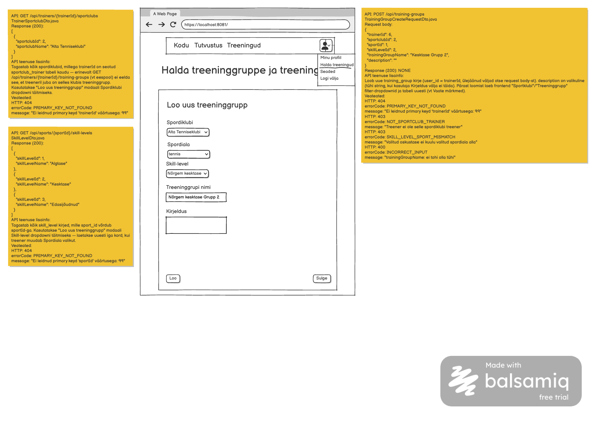

# Treeninggrupi loomine

**Teenus:** `POST /api/training-groups`

**Vaste balsamic mockupis:** "Loo uus treeninggrupp" modaal (avaneb vaatelt `ManageTrainingsView.vue`, route `/manage-trainings`, nupult "Loo uus Treeninggrupp"), lehekülg 1/1 failis `docs/balsamic/SportClub_Loo_treeninggrupp.pdf` (vt lisatud pilt `Treeninggrupi-loomine.png`). Vt ka vaate märkmeid failis `docs/balsamic/notes/ManageTrainingsView-markmed.md`.



## Sisend

Request body (`TrainingGroupCreateRequestDto.java`):

```json
{
  "trainerId": 6,
  "sportclubId": 2,
  "sportId": 1,
  "skillLevelId": 2,
  "trainingGroupName": "Kesktase Grupp 2",
  "description": ""
}
```

| Väli | Tüüp | Kohustuslik | Kirjeldus |
|---|---|---|---|
| `trainerId` | Integer | Jah | Treener, kelle omandusse uus grupp luuakse (`training_group.user_id`) — sisse logitud kasutaja id |
| `sportclubId` | Integer | Jah | Valitud spordiklubi (`training_group.sportclub_id`) — dropdown täidetud kutsega `GET /api/trainers/{trainerId}/sportclubs` (vt `Treeneri-sportklubide-nimekirja-paring.md`) |
| `sportId` | Integer | Jah | Valitud spordiala (`training_group.sport_id`) — dropdown täidetud kutsega `GET /api/sports` (juba implementeeritud, vt `SportController.java`) |
| `skillLevelId` | Integer | Jah | Valitud oskustase (`training_group.skill_level_id`) — dropdown täidetud kutsega `GET /api/sports/{sportId}/skill-levels` (vt `Spordiala-oskustasemete-nimekirja-paring.md`) |
| `trainingGroupName` | String | Jah | Treeninggrupi nimi (`training_group.name`), ei tohi olla tühi |
| `description` | String | Ei | Treeninggrupi kirjeldus (`training_group.description`) — mockup'i "Kirjeldus" väli, võib jääda tühjaks |

## Väljund

**Response (200 OK):** `NONE` — teenus ei tagasta body-d.

## Eesmärk

Treener klõpsab haldusvaate nupul "Loo uus Treeninggrupp", mis avab modaalakna "Loo uus treeninggrupp" (Spordiklubi, Spordiala, Skill-level, Treeninggrupi nimi, Kirjeldus). Nupule "Loo" vajutades saadetakse see päring; modaal sulgub ja vaade laeb "Sportklubi"/"Treeninggrupp" filter-dropdownid ning treeningute tabeli uuesti, et uus grupp oleks kohe valitav. Modaali "Sulge" nupp ei tee API kutset.

Teenuse loogika:

1. Kontrolli, et `trainerId`, `sportclubId`, `sportId`, `skillLevelId` viitavad kõik olemasolevatele kirjetele.
2. Kontrolli, et `trainerId` on `sportclub_trainer` kaudu seotud antud `sportclubId`-ga — vastasel juhul viga `NOT_SPORTCLUB_TRAINER`.
3. Kontrolli, et valitud `skillLevelId` kuulub valitud `sportId` alla (`skill_level.sport_id = sportId`) — vastasel juhul viga `SKILL_LEVEL_SPORT_MISMATCH`.
4. Loo uus `training_group` kirje (`sportclub_id`, `sport_id`, `user_id = trainerId`, `name = trainingGroupName`, `description`, `skill_level_id`).

## Seotud andmebaasi tabelid

Vt `docs/database/2_create.sql`.

### `training_group`

```sql
CREATE TABLE training_group (
    id serial  NOT NULL,
    sportclub_id int  NOT NULL,
    sport_id int  NOT NULL,
    user_id int  NOT NULL,
    name varchar(100)  NOT NULL,
    description varchar(255)  NULL,
    skill_level_id int  NOT NULL,
    CONSTRAINT traininggroup_pk PRIMARY KEY (id)
);
```

Uus kirje luuakse siia. Nimel (`name`) ega muul väljal pole andmebaasis unikaalsuspiirangut — sama klubi/spordiala/oskustaseme kombinatsiooniga gruppe võib olla mitu.

### `sportclub_trainer`

```sql
CREATE TABLE sportclub_trainer (
    id serial  NOT NULL,
    sportclub_id int  NOT NULL,
    user_id int  NOT NULL,
    CONSTRAINT sportclub_trainer_pk PRIMARY KEY (id)
);
```

Kasutatakse samm 2 kontrolliks (`NOT_SPORTCLUB_TRAINER`).

### `skill_level`

```sql
CREATE TABLE skill_level (
    id serial  NOT NULL,
    sport_id int  NOT NULL,
    name varchar(30)  NOT NULL,
    CONSTRAINT skilllevel_pk PRIMARY KEY (id)
);
```

Kasutatakse samm 3 kontrolliks (`SKILL_LEVEL_SPORT_MISMATCH`).

### `sportclub`, `sport`, `user`

Kasutatakse `sportclubId`/`sportId`/`trainerId` olemasolu kontrollimiseks (struktuurid vt `Treeneri-sportklubide-nimekirja-paring.md` ja `Spordiala-oskustasemete-nimekirja-paring.md`).

Näidisandmed (`3_import.sql`): `sportclub_trainer` kirje (`sportclub_id = 2`, `user_id = 6`) lubab treeneril Jaanus Tubli luua treeninggrupi klubis "Alta Tenniseklubi"; sama `trainerId`-ga (`6`) katse luua gruppi nt `sportclubId = 1` ("Beeta Tenniseklubi") peab tagastama `NOT_SPORTCLUB_TRAINER`, kuna vastavat `sportclub_trainer` kirjet pole.

## Veaolukorrad

| Olukord | Status code | Response body |
|---|---|---|
| `trainerId` väärtusega kasutajat ei leitud | 404 Not Found | `{"errorCode": "PRIMARY_KEY_NOT_FOUND", "message": "Ei leidnud primary keyd 'trainerId' väärtusega: 99"}` |
| `sportclubId` väärtusega spordiklubi ei leitud | 404 Not Found | `{"errorCode": "PRIMARY_KEY_NOT_FOUND", "message": "Ei leidnud primary keyd 'sportclubId' väärtusega: 99"}` |
| `sportId` väärtusega spordiala ei leitud | 404 Not Found | `{"errorCode": "PRIMARY_KEY_NOT_FOUND", "message": "Ei leidnud primary keyd 'sportId' väärtusega: 99"}` |
| `skillLevelId` väärtusega oskustaset ei leitud | 404 Not Found | `{"errorCode": "PRIMARY_KEY_NOT_FOUND", "message": "Ei leidnud primary keyd 'skillLevelId' väärtusega: 99"}` |
| Treener ei ole valitud spordiklubiga seotud (`sportclub_trainer` kirjet pole) | 403 Forbidden | `{"errorCode": "NOT_SPORTCLUB_TRAINER", "message": "Treener ei ole selle spordiklubi treener"}` |
| Valitud oskustase ei kuulu valitud spordiala alla | 403 Forbidden | `{"errorCode": "SKILL_LEVEL_SPORT_MISMATCH", "message": "Valitud oskustase ei kuulu valitud spordiala alla"}` |
| `trainingGroupName` on tühi | 400 Bad Request | `{"errorCode": "INCORRECT_INPUT", "message": "trainingGroupName: ei tohi olla tühi"}` |
| Ootamatu serveri viga | 500 Internal Server Error | — |

## Vastuvõtu kriteeriumid

- [ ] Endpoint `POST /api/training-groups` on olemas ja võtab vastu `TrainingGroupCreateRequestDto` JSON-i
- [ ] Õnnestunud loomisel tagastatakse 200 ilma response body-ta ja andmebaasi luuakse uus `training_group` kirje õigete väljadega (sh `user_id = trainerId`)
- [ ] Kui `trainerId` pole valitud `sportclubId`-ga `sportclub_trainer` kaudu seotud, tagastatakse 403 ja errorCode `NOT_SPORTCLUB_TRAINER`, uut kirjet ei looda
- [ ] Kui valitud `skillLevelId` ei kuulu valitud `sportId` alla, tagastatakse 403 ja errorCode `SKILL_LEVEL_SPORT_MISMATCH`, uut kirjet ei looda
- [ ] Tühi `trainingGroupName` tagastab 400 ja errorCode `INCORRECT_INPUT`
- [ ] Olematu `trainerId`/`sportclubId`/`sportId`/`skillLevelId` tagastab vastavalt 404 ja `PRIMARY_KEY_NOT_FOUND` sõnumiga õige väljanimega
- [ ] Kirjutatud on automaattestid: edukas loomine, treener pole klubiga seotud, oskustase-spordiala mittevastavus, tühi nimi, iga olematu FK-välja juhtum
