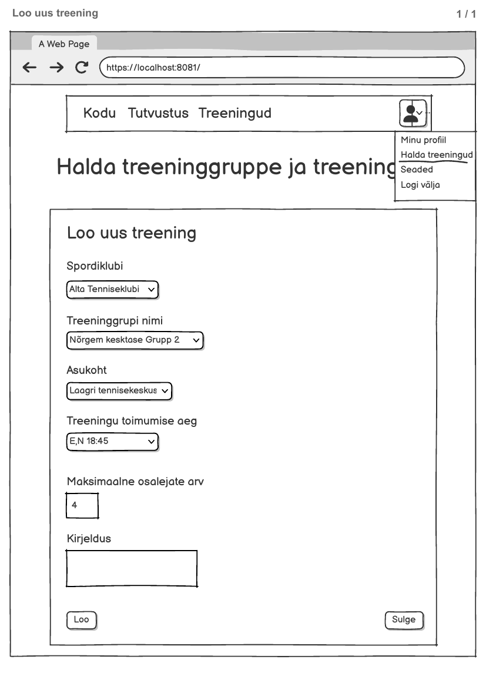

# Treeningu lisamine

**Teenus:** `POST /api/trainings`

**Vaste balsamic mockupis:** "Loo uus treening" vorm (avaneb vaatelt `ManageTrainingsView.vue`, route `/manage-trainings`, nupult "Loo uus Treening"), lehekülg 1/1 failis `docs/balsamic/SportClub_Loo_treening.pdf` (vt lisatud pilt `Treeningu-lisamine.png`). Vt ka vaate märkmeid failis `docs/balsamic/notes/ManageTrainingsView-markmed.md`.



> **Märkus:** Mockup'i leheküljel puudub kollane "API:" märge. Teenuse kontrakt (URL, request body väljad, vastus, `training_date` ridade genereerimine) on kokku lepitud kasutajaga taski koostamisel. Mockup'i vormile tuleb lisada väljad, mida `training` tabel nõuab, aga mida mockup ei näita: kestus ja perioodi algus- ning lõppkuupäev (vt "Lahtised otsad" allpool).

## Sisend

Request body (`TrainingCreateRequestDto.java`):

```json
{
  "trainerId": 6,
  "trainingGroupId": 2,
  "facilityId": 1,
  "weekdays": "E,N",
  "startTime": "18:45",
  "duration": 90,
  "startDate": "2026-10-05",
  "endDate": "2026-10-15",
  "maxSize": 4,
  "description": ""
}
```

| Väli | Tüüp | Kohustuslik | Kirjeldus |
|---|---|---|---|
| `trainerId` | Integer | Jah | Sisse logitud treeneri kasutaja id. Kasutatakse kontrolliks, et treeninggrupp kuulub just sellele treenerile. |
| `trainingGroupId` | Integer | Jah | Valitud treeninggrupp (`training.training_group_id`), mockupis "Treeninggrupi nimi" dropdown. Dropdown täidetakse kutsega `GET /api/trainers/{trainerId}/training-groups` (vt `Treeneri-treeninggruppide-nimekirja-paring.md`). Mockupi "Spordiklubi" dropdown on ainult frontendi filter, mis kitsendab treeninggruppide valikut. Backendile seda ei saadeta, sest spordiklubi tuleb treeninggrupi kirjest (`training_group.sportclub_id`). |
| `facilityId` | Integer | Jah | Valitud asukoht (`training.default_facility_id`, `training_date.facility_id`), mockupis "Asukoht" dropdown. |
| `weekdays` | String | Jah | Nädalapäevad, millal treening toimub: eestikeelsed lühendid `E`, `T`, `K`, `N`, `R`, `L`, `P` komaga eraldatult (nt `"E,N"`). Formaat on sama nagu `3_import.sql` andmetes (`'P'`, `'L'`). |
| `startTime` | String (`HH:mm`) | Jah | Treeningu algusaeg (`training.default_start_time`, `training_date.start_time`). |
| `duration` | Integer | Jah | Treeningu kestus minutites (`training.duration`, `training_date.duration`), peab olema > 0. |
| `startDate` | String (`yyyy-MM-dd`) | Jah | Perioodi algus (`training.default_start_date`), millest alates toimumiskorrad genereeritakse. |
| `endDate` | String (`yyyy-MM-dd`) | Jah | Perioodi lõpp (`training.default_end_date`), kaasa arvatud. Ei tohi olla varasem kui `startDate`. |
| `maxSize` | Integer | Jah | Maksimaalne osalejate arv (`training.maxsize`, `training_date.max_size`), peab olema > 0. |
| `description` | String | Ei | Treeningu kirjeldus (`training.description`), võib jääda tühjaks. |

Mockupi "Treeningu toimumise aeg" väli (`E,N 18:45`) jagatakse request body-s kaheks väljaks: `weekdays` ja `startTime`.

## Väljund

**Response (200 OK):** `NONE`, teenus ei tagasta body-d.

## Eesmärk

Treener vajutab haldusvaates nupule "Loo uus Treening" ja avaneb vorm "Loo uus treening". Treener valib spordiklubi, treeninggrupi ja asukoha, määrab toimumise nädalapäevad, kellaaja, kestuse, perioodi ja maksimaalse osalejate arvu ning soovi korral kirjelduse. Nupp "Loo" saadab selle päringu ja vaade laeb seejärel treeningute tabeli uuesti (`GET /api/trainers/{trainerId}/training-dates`). Nupp "Sulge" ei tee API kutset.

Teenus loob ühe `training` kirje (treeningu "malli") ja selle põhjal kõik konkreetsed toimumiskorrad (`training_date` read) antud perioodis. Nii ilmuvad need kohe treeneri tabelisse ja on kasutajatele registreerimiseks avatud.

Teenuse loogika:

1. Kontrolli, et `trainerId`, `trainingGroupId` ja `facilityId` viitavad olemasolevatele kirjetele.
2. Kontrolli, et treeninggrupp kuulub treenerile (`training_group.user_id = trainerId`). Kui ei kuulu, tagasta viga `NOT_TRAINING_GROUP_TRAINER`.
3. Valideeri sisend: `weekdays` sisaldab ainult lubatud lühendeid, `duration > 0`, `maxSize > 0` ja `endDate >= startDate`.
4. Loo uus `training` kirje:
   - `training_group_id = trainingGroupId`, `default_facility_id = facilityId`
   - `name` tuletatakse kujul `<training_group.name> (<facility.name>)`, nt `"Tennis - Kesktase (Laagri Tennisekeskus)"`. Muster on sama nagu `3_import.sql` andmetes.
   - `maxsize = maxSize`, `description = description`
   - `default_start_date = startDate`, `default_end_date = endDate`
   - `default_start_time = startTime`, `default_end_time = startTime + duration` (arvutatakse backendis), `duration = duration`
   - `weekdays = weekdays`
5. Genereeri iga kuupäeva kohta vahemikus `startDate..endDate` (kaasa arvatud), mille nädalapäev on `weekdays` hulgas, üks `training_date` kirje:
   - `training_id` = äsja loodud `training.id`, `facility_id = facilityId`
   - `start_date` = see kuupäev, `start_time = startTime`, `duration = duration`
   - `status = 'A'` (`Status.STATUS_ACTIVE`), `user_count = 0`, `max_size = maxSize`, `date_added` = tänane kuupäev
6. Kui vahemikku ei jää ühtegi sobivat kuupäeva, tagasta viga `NO_TRAINING_DATES` ja ära loo ka `training` kirjet. Kogu teenus peab olema ühes transaktsioonis (`@Transactional`).

Näide: ülaltoodud request body (`weekdays = "E,N"`, `2026-10-05..2026-10-15`) loob ühe `training` kirje ja neli `training_date` kirjet: **2026-10-05 (E), 2026-10-08 (N), 2026-10-12 (E), 2026-10-15 (N)**, kõik kell 18:45, kestus 90 min, `max_size = 4`, `user_count = 0`.

## Seotud andmebaasi tabelid

Vt `docs/database/2_create.sql`.

### `training`

```sql
CREATE TABLE training (
    id serial  NOT NULL,
    training_group_id int  NOT NULL,
    default_facility_id int  NOT NULL,
    name varchar(255)  NOT NULL,
    maxsize int  NOT NULL,
    description varchar(255)  NULL,
    default_start_date date  NULL,
    default_end_date date  NULL,
    default_start_time time  NOT NULL,
    default_end_time time  NOT NULL,
    duration int  NOT NULL,
    weekdays varchar(255)  NOT NULL,
    CONSTRAINT training_pk PRIMARY KEY (id)
);
```

Siia luuakse üks uus kirje.

### `training_date`

```sql
CREATE TABLE training_date (
    id serial  NOT NULL,
    training_id int  NOT NULL,
    facility_id int  NOT NULL,
    start_date date  NOT NULL,
    start_time time  NOT NULL,
    duration int  NOT NULL,
    status varchar(3)  NOT NULL,
    user_count int  NOT NULL,
    max_size int  NOT NULL,
    date_added date  NOT NULL,
    CONSTRAINT training_date_pk PRIMARY KEY (id)
);
```

Siia luuakse iga toimumiskorra kohta üks kirje (vt teenuse loogika samm 5).

### `training_group`

```sql
CREATE TABLE training_group (
    id serial  NOT NULL,
    sportclub_id int  NOT NULL,
    sport_id int  NOT NULL,
    user_id int  NOT NULL,
    name varchar(100)  NOT NULL,
    description varchar(255)  NULL,
    skill_level_id int  NOT NULL,
    CONSTRAINT traininggroup_pk PRIMARY KEY (id)
);
```

Kasutatakse treeneri omandiõiguse kontrolliks (`user_id`) ja treeningu nime tuletamiseks (`name`).

### `facility`

```sql
CREATE TABLE facility (
    id serial  NOT NULL,
    area_id int  NOT NULL,
    name varchar(255)  NOT NULL,
    address varchar(255)  NOT NULL,
    description varchar(255)  NULL,
    CONSTRAINT facility_pk PRIMARY KEY (id)
);
```

Kasutatakse `facilityId` olemasolu kontrolliks ja treeningu nime tuletamiseks (`name`).

### Näidisandmed (`3_import.sql`)

Mockupi väärtustele "Alta Tenniseklubi" / "Nõrgem kesktase Grupp 2" / "Laagri tennisekeskus" vastavad seemneandmetes kõige paremini:

| Mockup | Andmebaas |
|---|---|
| Spordiklubi "Alta Tenniseklubi" | `sportclub.id = 2`, "Alta Tenniseklubi" |
| Treeninggrupp "Nõrgem kesktase Grupp 2" | `training_group.id = 2`, "Tennis - Kesktase" (`sportclub_id = 2`, `user_id = 6`). Mockupi nimele täpset vastet pole. |
| Asukoht "Laagri tennisekeskus" | `facility.id = 1`, "Laagri Tennisekeskus" |
| Treener | `user_id = 6`, Jaanus Tubli |

Sama request `trainerId = 5`-ga (Jaana Kask) peab tagastama `NOT_TRAINING_GROUP_TRAINER`, sest treeninggrupi 2 omanik on `user_id = 6`.

Teenus **ei puuduta** tabeleid `sport_facility`, `user_training` ega `sportclub_trainer`.

## Veaolukorrad

| Olukord | Status code | Response body |
|---|---|---|
| `trainerId` väärtusega kasutajat ei leitud | 404 Not Found | `{"errorCode": "PRIMARY_KEY_NOT_FOUND", "message": "Ei leidnud primary keyd 'trainerId' väärtusega: 99"}` |
| `trainingGroupId` väärtusega treeninggruppi ei leitud | 404 Not Found | `{"errorCode": "PRIMARY_KEY_NOT_FOUND", "message": "Ei leidnud primary keyd 'trainingGroupId' väärtusega: 99"}` |
| `facilityId` väärtusega asukohta ei leitud | 404 Not Found | `{"errorCode": "PRIMARY_KEY_NOT_FOUND", "message": "Ei leidnud primary keyd 'facilityId' väärtusega: 99"}` |
| Treeninggrupp ei kuulu antud treenerile | 403 Forbidden | `{"errorCode": "NOT_TRAINING_GROUP_TRAINER", "message": "Antud treeninggrupp ei kuulu antud treenerile"}` |
| Valitud perioodi ei jää ühtegi valitud nädalapäeva | 403 Forbidden | `{"errorCode": "NO_TRAINING_DATES", "message": "Valitud perioodis ei toimu ühtegi treeningut"}` |
| `endDate` on varasem kui `startDate` | 400 Bad Request | `{"errorCode": "INCORRECT_INPUT", "message": "endDate: ei tohi olla varasem kui startDate"}` |
| `weekdays` on tühi või sisaldab lubamatut väärtust | 400 Bad Request | `{"errorCode": "INCORRECT_INPUT", "message": "weekdays: lubatud väärtused on E,T,K,N,R,L,P"}` |
| `duration` või `maxSize` ≤ 0 või puudub | 400 Bad Request | `{"errorCode": "INCORRECT_INPUT", "message": "maxSize: peab olema suurem kui 0"}` |
| Kohustuslik väli puudub (`trainingGroupId`, `facilityId`, `startTime`, `startDate`, `endDate`) | 400 Bad Request | `{"errorCode": "INCORRECT_INPUT", "message": "<väli>: ei tohi olla tühi"}` |
| Ootamatu serveri viga | 500 Internal Server Error | — |

`NOT_TRAINING_GROUP_TRAINER` ja `NO_TRAINING_DATES` on uued väärtused, mis tuleb lisada `Error.java` enumisse.

## Lahtised otsad

- **Asukoha dropdown:** backendis pole veel teenust asukohtade (`facility`) nimekirja pärimiseks ja `sport_facility` tabelis pole `3_import.sql`-s ühtegi kirjet. Asukohtade dropdowni jaoks on vaja eraldi taski (nt `GET /api/facilities`). Selles taskis ei kontrollita, kas asukoht sobib treeninggrupi spordialaga (`sport_facility`).
- **Mockup vajab täiendust:** vormile tuleb lisada väljad "Kestus (min)", "Alguskuupäev" ja "Lõppkuupäev". "Treeningu toimumise aeg" tuleks jagada nädalapäevade valikuks ja kellaajaks.
- **Kattuvused:** selles taskis ei kontrollita, kas samal asukohal ja ajal on juba mõni teine treening.

## Vastuvõtu kriteeriumid

- [ ] Endpoint `POST /api/trainings` on olemas ja võtab vastu `TrainingCreateRequestDto` JSON-i
- [ ] Õnnestunud loomisel tagastatakse 200 ilma response body-ta
- [ ] Andmebaasi luuakse üks `training` kirje õigete väljadega: `name` on tuletatud grupi ja asukoha nimest ning `default_end_time = startTime + duration`
- [ ] Andmebaasi luuakse `training_date` kirjed täpselt nendele kuupäevadele perioodis `startDate..endDate` (kaasa arvatud), mille nädalapäev on `weekdays` hulgas. Väljad: `status = 'A'`, `user_count = 0`, `max_size = maxSize`, `date_added` = tänane kuupäev. Näidispäringu puhul tekib 4 rida (05.10, 08.10, 12.10, 15.10.2026).
- [ ] Kui treeninggrupp ei kuulu treenerile, tagastatakse 403 ja errorCode `NOT_TRAINING_GROUP_TRAINER`, ühtegi kirjet ei looda
- [ ] Kui perioodi ei jää ühtegi sobivat kuupäeva, tagastatakse 403 ja errorCode `NO_TRAINING_DATES`, ka `training` kirjet ei looda (transaktsioon)
- [ ] Vigane sisend (`endDate < startDate`, vigane `weekdays`, `duration`/`maxSize` ≤ 0, puuduv kohustuslik väli) tagastab 400 ja errorCode `INCORRECT_INPUT`
- [ ] Olematu `trainerId`/`trainingGroupId`/`facilityId` tagastab 404 ja `PRIMARY_KEY_NOT_FOUND` sõnumiga, milles on õige välja nimi
- [ ] Kirjutatud on automaattestid: edukas loomine (sh genereeritud `training_date` ridade arv ja kuupäevad), võõras treeninggrupp, tühi periood, iga valideerimisviga ja iga olematu FK-välja juhtum
