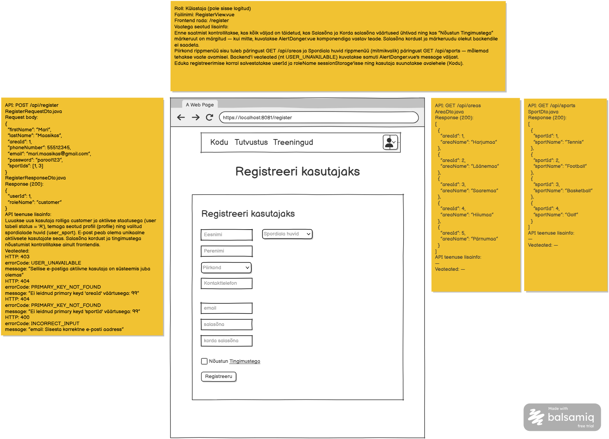

# Uue kasutaja registreerimisvorm

**Vaade:** `RegisterView.vue`, route `/register`

**Roll:** Külastaja (pole sisse logitud)

**Vaste balsamic mockupis:** "Registreeri kasutajaks", lehekülg 1/1 (vt lisatud pilt `Uue-kasutaja-registreerimisvorm.png`)



## Kasutajavoog

Külastaja avab vaate "Registreeri kasutajaks" (`/register`). Vaate avamisel laetakse taustal piirkondade ja spordialade nimekirjad, millega täidetakse vastavad rippmenüüd. Kasutaja täidab vormi väljad (nimi, piirkond, kontakttelefon, e-post, salasõna, salasõna kordus), valib ühe või mitu spordiala huvi, märgib "Nõustun Tingimustega" ja vajutab "Registreeru". Kui kõik kliendipoolsed kontrollid lähevad läbi, saadetakse andmed backendile ja eduka registreerimise korral on kasutaja kohe sisse logitud ning suunatakse avalehele.

Ülemine navigatsiooniriba (Kodu / Tutvustus / Treeningud ja päises olev kasutaja ikoon) on jagatud komponent, mida see task ei kata.

## Kasutajaliidese elemendid

| Element | Tüüp | Kirjeldus/käitumine |
|---|---|---|
| Eesnimi | tekstisisend | Kohustuslik |
| Perenimi | tekstisisend | Kohustuslik |
| Piirkond | rippmenüü (üksikvalik) | Kohustuslik, sisu laetakse `GET /api/areas` päringuga vaate avamisel |
| Spordiala huvid | rippmenüü (mitmikvalik) | Kohustuslik (vähemalt üks), sisu laetakse `GET /api/sports` päringuga vaate avamisel |
| Kontakttelefon | tekstisisend | Kohustuslik |
| email | tekstisisend | Kohustuslik, e-posti formaat |
| salasõna | paroolisisend | Kohustuslik |
| korda salasõna | paroolisisend | Kohustuslik, peab ühtima väljaga "salasõna"; backendile ei saadeta |
| "Nõustun Tingimustega" | märkeruut + link "Tingimustega" | Kohustuslik märkida enne saatmist; backendile ei saadeta. Lingi "Tingimustega" sihtkoht pole mockupis/märkmetes määratletud — täpsusta enne implementeerimist (nt eraldi tingimuste vaade või ajutine `#` link) |
| "Registreeru" nupp | nupp | Käivitab kliendipoolse valideerimise ja õnnestumisel saadab `POST /api/register` |
| Veateade | AlertDanger.vue | Kuvatakse valideerimis- või backend'i veateate korral |

## Käitumine ja valideerimine

1. Vaate avamisel (`beforeMount`) tehakse paralleelselt kaks päringut: `GET /api/areas` (täidab "Piirkond" rippmenüü) ja `GET /api/sports` (täidab "Spordiala huvid" rippmenüü).
2. Nupu "Registreeru" vajutusel kontrollitakse frontendis järjekorras:
   - kas kõik kohustuslikud väljad on täidetud,
   - kas "salasõna" ja "korda salasõna" väärtused ühtivad,
   - kas "Nõustun Tingimustega" märkeruut on märgitud.
   - Kui mõni kontroll ebaõnnestub, saadet ei tehta ja kuvatakse `AlertDanger.vue`'ga vastav teade; mockup/märkmed ei täpsusta iga juhtumi jaoks eraldi sõnastust, seega kasuta üht selget koondsõnumit (nt "Täida kõik väljad korrektselt").
3. Kui kliendipoolne valideerimine läbib, saadetakse `POST /api/register` request body'ga, mis **ei sisalda** "korda salasõna" ega "Nõustun Tingimustega" väärtusi (need on ainult frontendi kontrolliks).
4. **Õnnestumisel (200):** `userId` ja `roleName` salvestatakse `sessionStorage`'isse ning kasutaja suunatakse avalehele (`/`), kohe sisse logituna (samamoodi nagu edukal sisselogimisel, vt `docs/tasks/frontend/Sisselogimine-avalehel.md`).
5. **Ebaõnnestumisel** (403/404/400, vt allpool) kuvatakse `AlertDanger.vue`'ga backend'i `message` väli, vorm jääb täidetud kujule.

## API kutsed

### `GET /api/areas`

**Backend task:** vt `docs/tasks/backend/Piirkondade-nimekirja-paring.md`

`AreaDto.java` — response (200):

```json
[
  { "areaId": 1, "areaName": "Harjumaa" },
  { "areaId": 4, "areaName": "Hiiumaa" },
  { "areaId": 2, "areaName": "Läänemaa" },
  { "areaId": 5, "areaName": "Pärnumaa" },
  { "areaId": 3, "areaName": "Saaremaa" }
]
```

Vastus on juba backendis tähestikuliselt sorteeritud — frontend ei pea ise sorteerima.

**Veateated:** —

### `GET /api/sports`

**Backend task:** vt `docs/tasks/backend/Spordialade-nimekirja-paring.md`

`SportDto.java` — response (200):

```json
[
  { "sportId": 3, "sportName": "Basketball" },
  { "sportId": 2, "sportName": "Football" },
  { "sportId": 4, "sportName": "Golf" },
  { "sportId": 1, "sportName": "Tennis" }
]
```

Vastus on juba backendis tähestikuliselt sorteeritud — frontend ei pea ise sorteerima.

**Veateated:** —

### `POST /api/register`

**Backend task:** vt `docs/tasks/backend/Uue-kasutaja-registreerimine.md`

`RegisterRequestDto.java` — request body:

```json
{
  "firstName": "Mari",
  "lastName": "Maasikas",
  "areaId": 1,
  "phoneNumber": 55512345,
  "email": "mari.maasikas@gmail.com",
  "password": "parool123",
  "sportIds": [1, 3]
}
```

`RegisterResponseDto.java` — response (200):

```json
{
  "userId": 1,
  "roleName": "customer"
}
```

`roleName` on registreerimisel alati `customer`.

**Veateated:**

| Status code | errorCode | message | Frontend käitumine |
|---|---|---|---|
| 403 Forbidden | `USER_UNAVAILABLE` | "Sellise e-postiga aktiivne kasutaja on süsteemis juba olemas" | Kuva `AlertDanger.vue`'ga sõnum |
| 404 Not Found | `PRIMARY_KEY_NOT_FOUND` | "Ei leidnud primary keyd 'areaId' väärtusega: 99" | Kuva `AlertDanger.vue`'ga sõnum (praktikas ei tohiks tekkida, kuna "Piirkond" täidetakse samast API-st) |
| 404 Not Found | `PRIMARY_KEY_NOT_FOUND` | "Ei leidnud primary keyd 'sportId' väärtusega: 99" | Kuva `AlertDanger.vue`'ga sõnum (praktikas ei tohiks tekkida, kuna "Spordiala huvid" täidetakse samast API-st) |
| 400 Bad Request | `INCORRECT_INPUT` | "email: Sisesta korrektne e-posti aadress" | Kuva `AlertDanger.vue`'ga sõnum |
| 400 Bad Request | `INCORRECT_INPUT` | "sportIds: Vali vähemalt üks spordiala" | Kuva `AlertDanger.vue`'ga sõnum (praktikas ei tohiks tekkida, kuna frontend nõuab juba enne saatmist vähemalt ühte valikut) |

## Komponendid ja failistruktuur

Vastavalt `docs/frontend/projekti-struktuur.md` konventsioonile:

- `src/views/RegisterView.vue` — vormi vaade route'il `/register`. **NB:** seda faili ega vastavat router'i rada (`frontend/src/router/index.js`) praegu veel ei eksisteeri — mõlemad tuleb selle taski käigus luua.
- `src/components/forms/AreaDropdown.vue` — piirkonna üksikvaliku rippmenüü (analoogselt `docs/frontend/vue-komponendi-struktuur.md` `ParentsDropdown` näitele: prop `areas`, emit `event-area-selected`)
- `src/components/forms/SportsMultiSelect.vue` — spordialade mitmikvaliku rippmenüü (prop `sports`, emit nt `event-sports-selected` valitud `sportId`-de massiiviga)
- `src/api-services/AreaService.js` — `GET /api/areas`
- `src/api-services/SportService.js` — `GET /api/sports`
- `src/api-services/RegisterService.js` — `POST /api/register`

Komponendi sisemine ülesehitus (`data`/`methods` struktuur, `event-` eesliitega emits, `.then()/.catch()/.finally()` API päringu muster, `beforeMount` andmete laadimiseks) järgib `docs/frontend/vue-komponendi-struktuur.md` eeskuju — vt sealset täielikku näidiskomponenti.

## Vastuvõtu kriteeriumid

- [ ] Route `/register` on olemas ja kuvab `RegisterView.vue`
- [ ] Vaate avamisel täidetakse "Piirkond" ja "Spordiala huvid" rippmenüüd vastavalt `GET /api/areas` ja `GET /api/sports` vastustest
- [ ] Kõik mockupil nähtavad väljad (eesnimi, perenimi, piirkond, kontakttelefon, email, salasõna, korda salasõna, nõustumise märkeruut) on vormil olemas
- [ ] "Registreeru" nupp ei saada päringut, kui mõni kohustuslik väli on tühi, salasõnad ei ühti või nõustumise märkeruut on märkimata — kuvatakse `AlertDanger.vue` teade
- [ ] Õnnestunud valideerimise korral saadetakse `POST /api/register` ilma "korda salasõna" ja nõustumise väärtusteta
- [ ] Õnnestunud registreerimisel salvestatakse `userId` ja `roleName` `sessionStorage`'isse ning kasutaja suunatakse avalehele (`/`)
- [ ] Backend'i veateated (`USER_UNAVAILABLE`, `PRIMARY_KEY_NOT_FOUND`, `INCORRECT_INPUT`) kuvatakse `AlertDanger.vue`'ga backend'i `message` väljast
